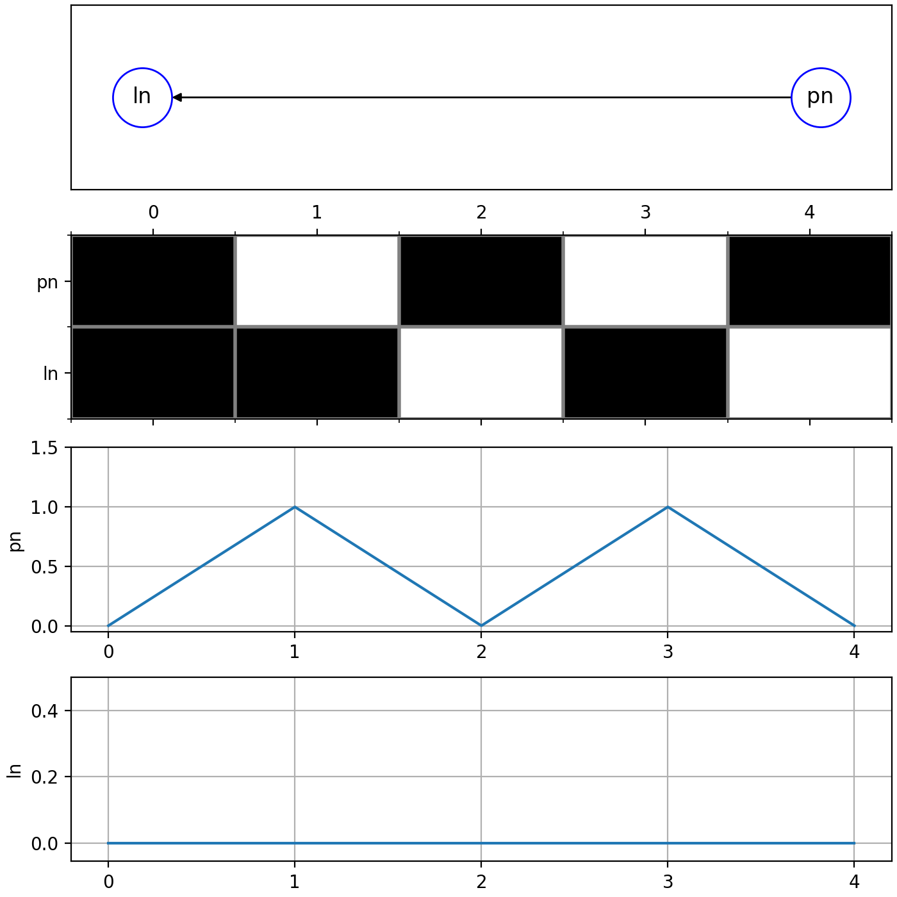

# SimSNN

 

A spiking neural network simulator developed and maintained by Radboud University staff and students.

## Requirements
To run the program, make sure you have installed the dependencies listed in environment.yml. 
We recommend creating a conda environment for every project. You can do this with the following command:
`conda env create --file environment.yml`

## Usage

### On Google Colab

Click on the badge to open the notebook in google colab. Then run every cell to see the example output. 

### Locally using jupyter notebooks
Clone this repository or download the zipped version. Unzip and open a terminal in the project directory. From there you can install the conda requirements, as mentioned before. You can also run the notebook by running 

`jupyter lab ./example.ipynb` 

### Locally from the command line
To run the example network, located in the examples directory, open up a terminal in the project directory and run the following command: 

`python -m simsnn`

You should be presented with a read out from the connected measuring tools like this:

(see [homepage](https://gitlab.socsci.ru.nl/neuromorphiccomputing/simsnn) if the image doesn't render correctly.)
